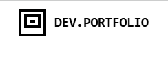

# Adam Abdalla - Portfolio Website

A modern, responsive portfolio website showcasing engineering projects and professional experience. Built with Next.js, TypeScript, and featuring a minimalist black/white design with smooth animations.



## 🚀 Features

### Core Functionality
- **Dynamic Project Syncing** - Automatic synchronization between projects page and homepage terminal
- **Interactive Terminal Section** - Live terminal-style project listing on homepage
- **Expandable Project Cards** - READ_MORE functionality for detailed project information
- **Functional Contact Form** - Email integration with Resend API (demo mode available)
- **Responsive Design** - Fully responsive across all device sizes
- **Smooth Animations** - Framer Motion animations throughout the site

### Pages & Sections
- **Homepage** - Hero section, skills showcase, interactive terminal, and CTA
- **About** - Personal introduction, hobbies, core values, and current projects
- **Projects** - Featured and all projects with detailed metrics and technologies
- **Experience** - Professional journey, education, certifications, and resume download
- **Contact** - Functional contact form with validation and email integration

### Technical Features
- **TypeScript** - Full type safety throughout the application
- **Shared Data Architecture** - Centralized project data with automatic syncing
- **Theme Provider** - Consistent styling system
- **Component Library** - Reusable UI components with shadcn/ui
- **Performance Optimized** - Next.js optimizations and best practices

## 🛠️ Tech Stack

- **Framework**: Next.js 14 (App Router)
- **Language**: TypeScript
- **Styling**: Tailwind CSS
- **Animations**: Framer Motion
- **UI Components**: shadcn/ui + Radix UI
- **Icons**: Lucide React
- **Email**: Resend API
- **Development**: ESLint, Prettier
- **Deployment**: Vercel-ready

## 📦 Installation

1. **Clone the repository**
   ```bash
   git clone https://github.com/Damadimo/portfolio
   cd portfolio
   ```

2. **Install dependencies**
   ```bash
   npm install
   # or
   pnpm install
   # or
   yarn install
   ```

3. **Set up environment variables (Optional)**
   Create a `.env.local` file in the root directory:
   ```env
   # Optional - for email functionality
   RESEND_API_KEY=your_resend_api_key_here
   ```
   If not provided, the contact form will run in demo mode.

4. **Run the development server**
   ```bash
   npm run dev
   # or
   pnpm dev
   # or
   yarn dev
   ```

5. **Open [http://localhost:3000](http://localhost:3000)** in your browser

## 🔧 Configuration

### Environment Variables
Create a `.env.local` file in the root directory:

```env
# Email Configuration (Optional - uses demo mode if not provided)
RESEND_API_KEY=your_resend_api_key_here
```

### Adding Projects
Projects are managed in `lib/projects-data.ts`. To add a new project:

1. Add the project object to the `projects` array
2. Update the `getTerminalProjectNames()` function if needed for custom terminal naming
3. Projects automatically sync to both the projects page and homepage terminal

Example project structure:
```typescript
{
  id: 7,
  title: "New Project Title",
  description: "Detailed project description with technical implementation details...",
  image: "/project-cover.png",
  technologies: ["Next.js", "TypeScript", "Tailwind CSS"],
  category: "Full-Stack",
  featured: false,
  status: "Completed",
  metrics: {
    performance: "95% lighthouse score",
    users: "1000+ active users",
    efficiency: "50% faster than previous solution",
  },
  links: {
    github: "https://github.com/Damadimo/project-repo",
    demo: "https://project-demo.vercel.app"
  },
}
```

## 📁 Project Structure

```
portfolio-website/
├── app/                          # Next.js App Router
│   ├── about/                    # About page
│   ├── api/contact/              # Contact form API route
│   ├── contact/                  # Contact page
│   ├── experience/               # Experience page
│   ├── projects/                 # Projects page
│   ├── globals.css              # Global styles
│   ├── layout.tsx               # Root layout
│   └── page.tsx                 # Homepage
├── components/                   # Reusable components
│   ├── ui/                      # shadcn/ui components
│   ├── navigation.tsx           # Navigation component
│   └── theme-provider.tsx       # Theme provider
├── lib/                         # Utilities and data
│   ├── projects-data.ts         # Shared projects data
│   └── utils.ts                 # Utility functions
├── public/                      # Static assets
│   ├── *.png                    # Project images
│   └── *.pdf                    # Resume file
├── styles/                      # Additional styles
└── README.md                    # This file
```

## 🎨 Customization

### Styling
- **Colors**: Modify colors in `tailwind.config.ts`
- **Fonts**: Font configurations in `app/globals.css`
- **Components**: Customize UI components in `components/ui/`

### Content
- **Personal Info**: Update content in respective page files (`app/about/page.tsx`, `app/experience/page.tsx`)
- **Projects**: Modify `lib/projects-data.ts` to add/edit projects
- **Resume**: Replace `public/Adam_Abdalla_Resume_S25f.pdf` with your resume
- **Images**: Update project images in `public/` directory

### Contact Form
The contact form supports two modes:
- **Demo Mode**: Logs submissions to console (default)
- **Email Mode**: Sends actual emails via Resend (requires API key)

## Deployment

### Vercel (Recommended)
1. Push your code to GitHub
2. Connect your repository to Vercel
3. Add `RESEND_API_KEY` environment variable in Vercel dashboard (optional)
4. Deploy automatically on push to main branch

### Other Platforms
The project can be deployed on any platform supporting Next.js:
- Netlify
- AWS Amplify
- Digital Ocean App Platform
- Railway

## 📝 Scripts

```bash
npm run dev          # Start development server
npm run build        # Build for production
npm run start        # Start production server
npm run lint         # Run ESLint
npm run type-check   # Run TypeScript type checking
```

## Contributing

This is a personal portfolio project, but if you'd like to suggest improvements:

1. Fork the repository
2. Create a feature branch
3. Make your changes
4. Submit a pull request

## 📄 License

This project is open source and available under the [MIT License](LICENSE).

## 📧 Contact

Adam Abdalla - [adam1.abdalla@gmail.com](mailto:adam1.abdalla@gmail.com)

Portfolio: [ gonna host it soon!]()
LinkedIn: [Adam Abdalla](https://linkedin.com/in/adabdal)
GitHub: [@Damadimo](https://github.com/Damadimo)

---

Built using Next.js, TypeScript, and Tailwind CSS 